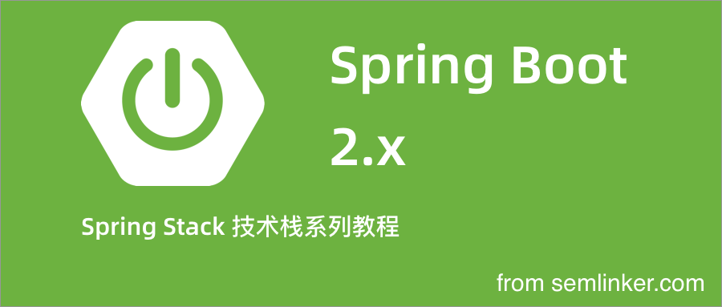

## Spring Stack 技术栈系列教程

### 一、Spring Boot 2.x 系列教程

#### 目录

- [Spring Boot 2.x (一)：第一个 Web 应用 Hello Spring Boot 2](https://semlinker.com/hello-springboot2/)  —— hello-springboot2 目录
- [Spring Boot 2.x (二)：Spring Boot 基础配置](https://semlinker.com/springboot2-configuration/) —— springboot2-configuration
- [Spring Boot 2.x (三) ：跨域处理方案之 Cors](https://semlinker.com/springboot2-cors/) —— springboot2-cors

### 二、Spring Security 5.2 系列教程

- Spring Security 入门之基本概念
- Spring Security 架构简介
- Spring Boot 2.x 集成 Spring Security
- Spring Security 自定义用户认证
- Spring Security 默认登录流程详解
- Spring Security 图形验证码登录

